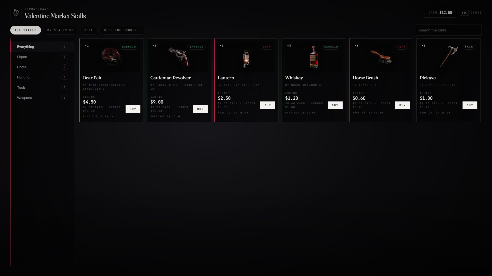

# lxr-market — The second-hand stalls, for LXRCore

A broker at each town takes goods on consignment: list what you carry at
a price, the broker keeps a cut, anyone browsing can buy, and you collect
what was earned at any broker. Listings run out after a while and the
goods come back to your shelf with the broker. The ledger value sits
beside every asking price, so buyers know a bargain from a robbery.



## What it does

* **The stalls** — every listing as a card with its picture, seller, asking price, the ledger value and a verdict (bargain / fair / dear); search and category chips.
* **Sell** — pick from your satchel, set amount and total price, pay the listing fee; up to `maxListings` at a time, `days` on the stalls.
* **My stalls** — take a listing back; **with the broker** — earnings waiting and returned goods (expired or cancelled when your satchel was full); collect in one go.
* **Rules** — `Config.Market`: cut, fee, days, price bounds, illegal goods refused (the fence is for those), excluded categories, one shared market or per-broker stalls.
* **Events** — `lxr:market:listed`, `lxr:market:sold`.

## Install

```cfg
ensure lxr-core
ensure lxr-inventory
ensure lxr-interact
ensure lxr-market
```

Tables `lxr_market_listings` and `lxr_market_shelf` are created by the core migration runner.

## API

| Name | Side | Purpose |
|---|---|---|
| `Listings(scope?)` | server | current listings |
| `IsOpen()` | client | stalls open |

## Building the interface

Vite + React + TypeScript: source in `ui/`, built output in `html/` (`cd ui && npm install && npm run build`). `style.css` uses kit tokens only; `tools/kit_check.py` guards it.

## Licence

© 2026 iBoss21 / LXRCore — All Rights Reserved. See `LICENSE`.
